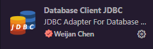
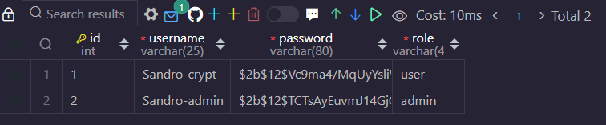

#  sample-flask-auth 
O projeto sample-flask-auth foi construído como aprendizado de programação backend na <strong>Formação Python</strong> da <a href="www.rocketseat.com.br"><strong>rocketseat</strong></a>
  
API de autenticação simples, utilizando do flask_login para abstrair métodos de login e logout, além de definir rotas que somente usuários autenticados possam acessar.
  
Gerenciamentos de perfis com a modelagem em database, utilizando a coluna "role" para diferenciar usuários de administrados.
  
Senhas criptografadas utilizando a biblioteca bcrypt.
  
Banco de dados conteinerizado, para que qualquer pessoa possa executar a aplicação, independente do sistema operacional utilizado.

##  CLONANDO O REPO E INSTALANDO DEPENDÊNCIAS 
> Com o terminal aberto, execute os passos abaixo:

<ul>
    <li> git clone https://github.com/sandromzljr/sample-flask-auth.git
    <li> pip install -r requirements.txt
    <li> <a href="https://docs.docker.com/desktop/">Docker</a>
</ul>

##  EXECUTANDO SERVIDOR FLASK 
> Com o terminal aberto e dentro da pasta raiz, execute os passos abaixo:

<ul>
<li> python app.py
<li> docker compose up -d
</ul>

##  TESTANDO API 
> Para testar a API, utilize o Postman <a href="https://learning.postman.com/docs/getting-started/installation/installation-and-updates/">Instalação Postman</a>

### Rotas Postman
<ul>
<li> POST User -> 127.0.0.1/user
<li> POST Login -> 127.0.0.1/login
<li> * GET User by ID -> 127.0.0.1/user/&ltid&gt
<li> * GET Logout -> 127.0.0.1/logout
<li> ** PUT Update User by ID -> 127.0.0.1/user/&ltid&gt
<li> ** DEL Delete User by ID -> 127.0.0.1/user/&ltid&gt
</ul>

> Itens marcados com "*" requer usuário autenticado para acessar a rota
 
> Itens marcados com "**" requer usuário autenticado e role de admin para acessar a rota
 

<strong>PARA CRIAR UM USUÁRIO "ADMIN", NECESSÁRIO ACESSAR AO BANCO DE DADOS E ALTERAR O ROLE PADRÃO DE "USER" PARA "ADMIN".

##  DICA 
Caso utilize VSCode, utilize a extensão Database Cliente JDBC por Weijan Chen, para fazer esta alteração.

##  DATABASE 

